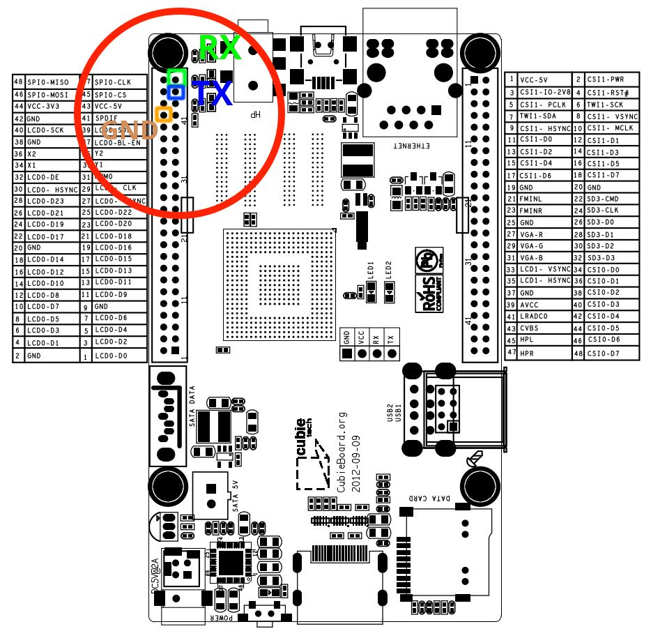

# Cubieboard2-alarm-device-tree-example
This repo show an example how to enable UART port on cubieboard2 (A20), Arch Linux ARM platform.  


## Introduction

Usually user would use stock OS image for cubieboard2, these are officially support by cubieTech team (including Android, Cubieez, Debian), so their Kernel is __customized__, NOT same as the mainline kernel. The term '_mainline kernel_' means the official (idk whether this description is correct or not lol ) of Linux kernel, if you download Ubuntu Desktop 18.04 from official website, then that Ubuntu are using mainline kernel. 

What Cubieboard2 stock OS image using are 'Sunxi Kernel', it integrated some extra drivers and stuffs inside the kernel, and the kernel modules management mechanism are different to mainline kernel, because it base on mainline kernel version 2.x, it's already an old things. 

It didnt have Device Tree Blob for describing hardware, but Mainline Linux uses it to activate and configure the drivers available in the kernel's binary.

Sunxi Kernel use another file named _script.bin_, and require decode to script.fex for edit (using tools call bin2fex and fex2bin).

Alarm (Arch Linux ARM) is the ARM arch version of Arch Linux which support many Soc system, sure it uses mainline kernel. *.dtb is the compiled binary blob for system hardware, and we can decompile it back to *.dts so we can modify it.

*How Device Tree work


Bootloader does matter, _mainline u-boot_ will be used for mainline kernel. Google it for more information :D

( btw, someone said that Sunxi Kernel has back-door ... :-) )


## Something you need to Know Before start ...

1. UART0 (a.k.a serial0) is the __default interface for debugging__ , the tty terminal I/O, which means you should __NEVER__ use this interface for communication to other peripheral devices. I use it only if no SSH are setup.
2. UART0 (a.k.a serial0) pinout: middle of PCB, it is labeled. __DO NOT__ connect the __VCC__ pin otherwise it may damage the board.
3. You may need a USB to TTL cable for testing. My one use CH340 IC, it works on Linux (no need to install driver manually).
4. This method __NO__ need to recompile kernel.


## Tools

- Install Device Tree Compile (dtc) on Cubieboard2

  ```bash
  sudo pacman -S dtc
  ```

- Install gtkterm (or other serial terminal) on your PC

  ```bash
  sudo apt install gtkterm
  ```


## How To

... Suppose I want to enable UART5 port.

1. Connect to Cubieboard by ssh, then locate and copy the {device}.dtb file of your device.

   ```shell
   ssh user@your_cubieboard # remote connect
   
   # create work dir
   mkdir ~/dir
   mkdir ~/dir/backup
   
   # dtb store in /boot/dtbs/
   cd /boot/dtbs/
   sudo cp sun7i-a20-cubieboard2.dtb ~/dir/backup/sun7i-a20-cubieboard2.dtb  # backup
   ```


2. Decompile dtb to dts

   ```shell
   dtc -I dtb -O dts ~/dir/backup/sun7i-a20-cubieboard2.dtb > ~/dir/sun7i-a20-cubieboard2.dts
   
   vim ~/dir/sun7i-a20-cubieboard2.dts
   ```

   The dts should already declare all hardware interface pinout, just some interface didnt enable. Where should we start?  Search uart5 pinout first.

3. To know the pinout config reference id, you can search `uart5` , then you can see something like this:

   ```shell
   ...
   			uart5@0 {
   				pins = "PI10\0PI11";			# pin PI10 TX and PI11 RX
   				function = "uart5";
   				linux,phandle = < 0x8f >;
   				phandle = < 0x8f >;				# this is the reference id you need
   			};
   ...
   ```

   Here we use default pin config, and it is already defined in the dts file (given reference is 0x8f ). What we need to do is remember the ref id, it will be used in next step.

4. Search `serial@01c28000`, it belongs to UART0, the default one.

   Go to `serial@01c29400` section, it belongs to __UART5__. You can see some of the serial interface (UART) their status are "disabled". To make it enable, change to "okay".

   Add two line `pinectrl-names` and `pinctrl-0` to configure the pins of UART5. `pinctrl-0` should equal to the ref id mention in last step.

   Don't modify`phandle` and `linux,phandle`, it is a unique ID for that section which will be reference by kernel.

   ```shell
   ...
   
   		serial@01c29400 {
   			compatible = "snps,dw-apb-uart";
   			reg = < 0x1c29400 0x400 >;
   			interrupts = < 0x00 0x12 0x04 >;
   			reg-shift = < 0x02 >;
   			reg-io-width = < 0x04 >;
   			clocks = < 0x3f 0x15 >;
   			status = "okay";				# change to "okay"
   			pinctrl-names = "default";		# pin config name
   			pinctrl-0 = < 0x8f >;			# reference id to pin config
   			linux,phandle = < 0xa3 >;
   			phandle = < 0xa3 >;
   		};
   ...
   
   ```

5. Define aliases for __UART5__:

   ```shell
   # around line 38
   ...
   aliases {
       ethernet0 = "/soc@01c00000/ethernet@01c50000";
       serial0 = "/soc@01c00000/serial@01c28000";  # default UART0, debug tty 
       serial5 = "/soc@01c00000/serial@01c29400";  # added this line to enable UART5
   };
   ...
   ```

6. Compile dts back to dtb, replace the original one in `/boot/dtbs/`, then reboot:

   ```shell
   dtc -O dtb -o ~/dir/sun7i-a20-cubieboard2.dtb -b O -@ ~/dir/backup/sun7i-a20-cubieboard2.dts
   sudo cp ~/dir/sun7i-a20-cubieboard2.dtb /boot/dtbs
   sudo reboot
   ```

7. Connect the UART pins to the USB to TTL cable. Remember to connect the GND. 

   

   More info: the pins schematic is here: http://docs.cubieboard.org/cubieboard1_and_cubieboard2_gpio_pin

8. Open `gtkterm` on your PC, the interface should be `/dev/ttyUSB0` if you are using USB to TTL. Config gtkterm, set buadrate to 115200.

9. Use the program `uart_test` in the repo to test whether UART5 work or not :D
   Or compile with gcc:

   ```shell
   gcc -o uart_test uart_test.c
   
   # To use the program: ./uart_test {tty interface}
   # if you have uart0 1 2 3 4 5 then ttyS0=uart0, ttyS5=uart5
   # if you have uart0 2 3 5, then ttyS3=uart5
   ./uart_test ttyS5
   ```

10. When program execute, cubieboard will send "hello world" to your PC via serial interface. You type "hello world" on gtkterm then press enter to reply it. If everything okay, it will print something like "Read Test Data finished".

